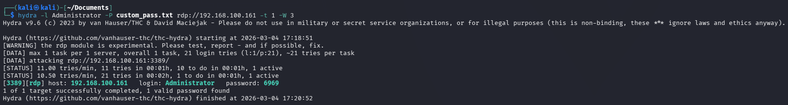
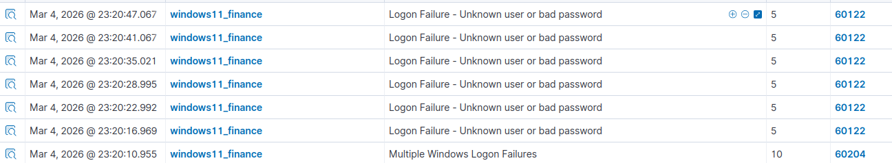
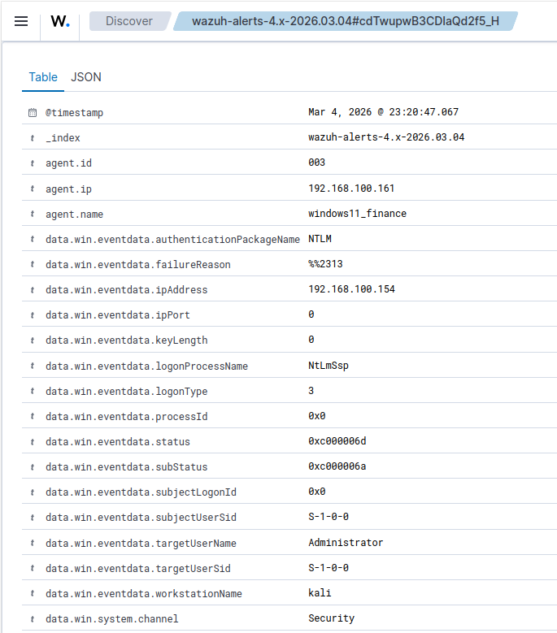
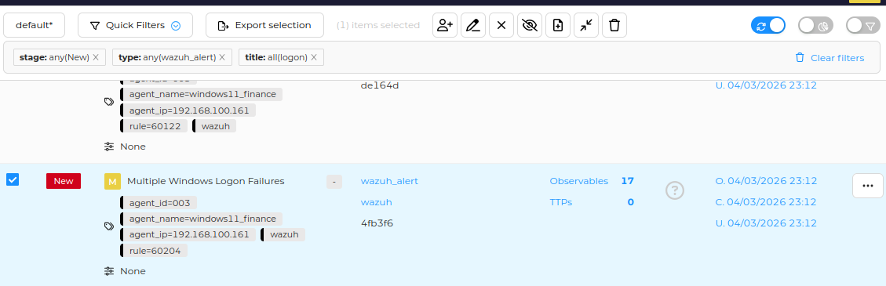
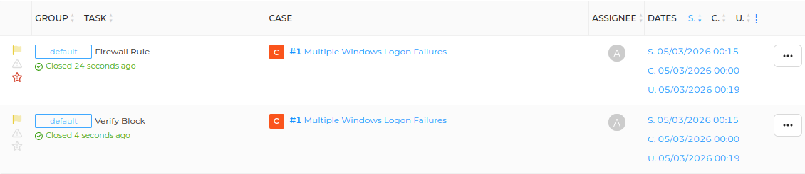
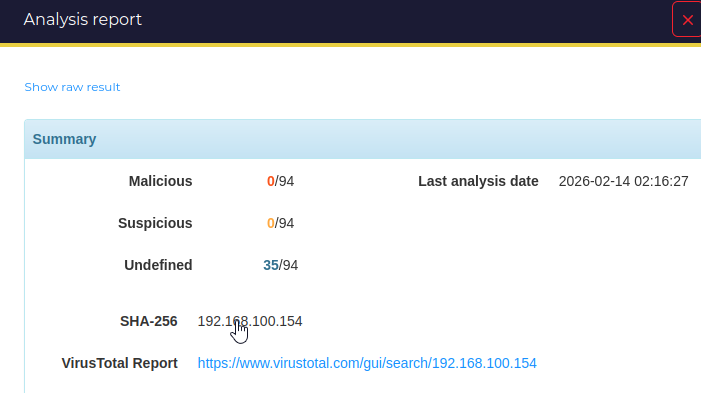
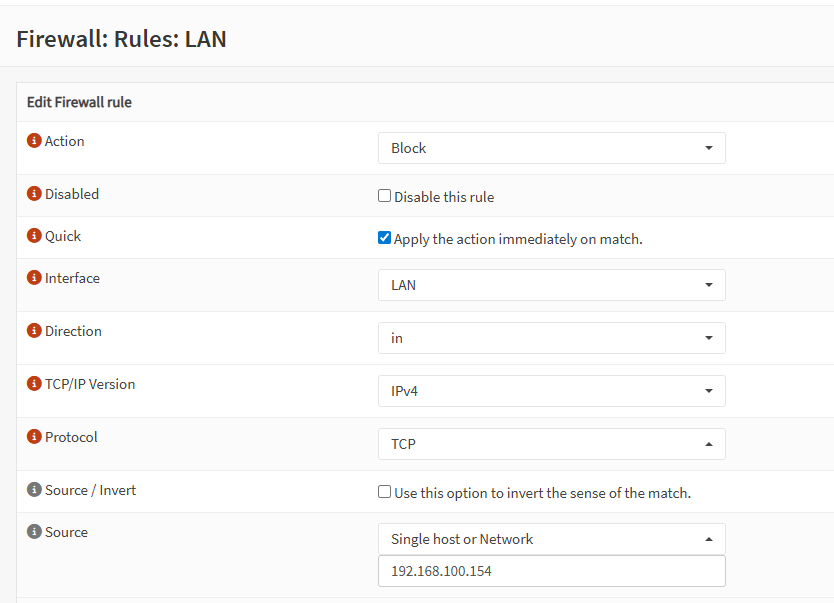
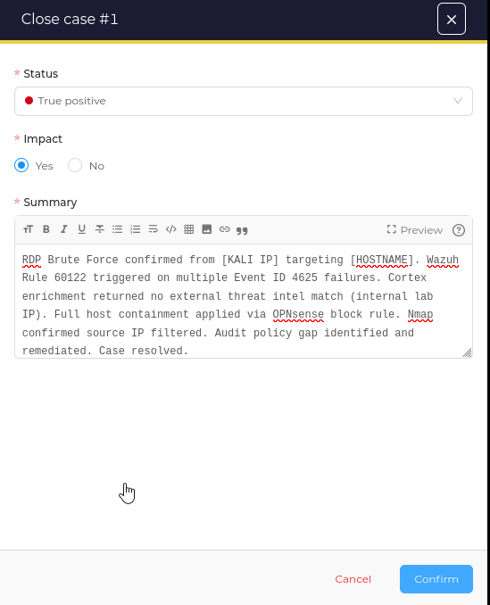

# BC-001 — RDP Brute Force: Credential Access Detection & Response

| Field | Detail |
|---|---|
| **Case ID** | BC-001 |
| **Date** | March 4, 2026 |
| **Severity** | 🟠 Medium → Escalated to 🔴 High |
| **Status** | ✅ Resolved — True Positive |
| **MITRE Tactic** | Credential Access |
| **MITRE Technique** | [T1110 — Brute Force](https://attack.mitre.org/techniques/T1110/) |
| **Attacker Host** | 192.168.100.154 (Kali Linux) |
| **Target Host** | 192.168.100.161 (windows11_finance) |
| **Detection Source** | Wazuh Rule 60122 / 60204 |

---

## 🧭 Overview

I simulated an RDP brute force attack from a Kali Linux VM against a Windows 11 endpoint (`windows11_finance`) representing a finance department workstation. The attack was detected by Wazuh via repeated Windows Event ID 4625 failures, automatically forwarded to TheHive through a custom Python integration, enriched using Cortex analyzers, and contained via an OPNsense firewall block rule.

This case also uncovered a detection gap in Windows audit policy configuration — a successful credential validation by Hydra was not logged as a 4624 event in Wazuh — which was identified, root-caused, and remediated during the investigation.

---

## 🎯 Objectives

- Simulate a realistic RDP brute force attack against a Windows endpoint
- Validate Wazuh detects and correlates repeated authentication failures
- Triage the alert end-to-end through the automated Wazuh → TheHive pipeline
- Enrich the attacker IP observable using Cortex analyzers
- Apply full host containment via OPNsense firewall rule
- Identify and remediate a Windows audit policy detection gap

---

## 🧰 Tools & Technologies

| Tool | Purpose |
|---|---|
| **Kali Linux + Hydra v9.6** | Attack simulation — RDP brute force |
| **Wazuh** | SIEM detection — Event ID 4625 correlation, Rules 60122 / 60204 |
| **TheHive** | Incident case management and analyst workflow |
| **Cortex + VirusTotal** | Observable enrichment — IP reputation analysis |
| **OPNsense** | Perimeter containment — firewall block rule |
| **Nmap** | Containment verification |

---

## 🏗️ Lab Environment

- **Attacker:** Kali Linux VM — `192.168.100.154`
- **Target:** Windows 11 VM (`windows11_finance`) — `192.168.100.161`, Wazuh Agent ID 003
- **SIEM:** Wazuh Manager on Ubuntu Server VM
- **IR Stack:** TheHive + Cortex deployed via Docker Compose on Ubuntu Server
- **Firewall:** OPNsense with Suricata IPS on LAN interface
- **Network:** Isolated VMware LAN subnet — all VMs on the same /24 segment

---

## ⚔️ Phase 1 — Attack Simulation

I launched the brute force from Kali using **Hydra v9.6** targeting RDP (port 3389) on the Windows 11 endpoint:

```bash
hydra -l Administrator -P custom_pass.txt rdp://192.168.100.161 -t 1 -W 3
```

- `-t 1` — single thread to generate realistic sequential login noise in Windows Security logs
- `-W 3` — 3 second wait between attempts to avoid rate-limit drops
- Password list contained 21 entries including the valid credential

Hydra confirmed valid credentials for the `Administrator` account after approximately 2 minutes of attempts.


*Hydra v9.6 — valid credential identified for Administrator account on 192.168.100.161:3389*

---

## 🔍 Phase 2 — Detection

### Wazuh Alert Spike — Rules 60122 & 60204

Wazuh detected the attack via Windows Event ID **4625** (failed logon) forwarded from the `windows11_finance` agent. Rule **60122** (Logon Failure) fired on each individual failure, with Rule **60204** (Multiple Windows Logon Failures) triggering as the aggregated correlation rule at severity level 10.


*Wazuh Security Events — repeated Rule 60122 alerts from windows11_finance, followed by Rule 60204 aggregation trigger. All events originate from the same agent within a 37-second window.*

---

### Wazuh Event Detail — Attacker Metadata

Drilling into an individual 4625 event confirmed the full attack context directly from Windows event telemetry:


*Wazuh Discover — event metadata confirming attacker IP 192.168.100.154, target account Administrator, workstation name kali, logon type 3 (Network), NTLM authentication package*

Key fields extracted:

| Field | Value | Significance |
|---|---|---|
| `data.win.eventdata.ipAddress` | 192.168.100.154 | Attacker source IP |
| `data.win.eventdata.targetUserName` | Administrator | Targeted account |
| `data.win.eventdata.workstationName` | kali | Confirms attacker hostname |
| `data.win.eventdata.logonType` | 3 | Network logon — remote access attempt |
| `data.win.eventdata.authPackage` | NTLM | Authentication protocol used |
| `rule.mitre.id` | T1110 | MITRE technique auto-mapped by Wazuh |
| `rule.mitre.tactic` | Credential Access | MITRE tactic |
| `rule.firedtimes` | 63 | Rule fired 63 times across the attack window |

---

## ⚠️ Detection Gap — Missing Event ID 4624

### Finding

Despite Hydra confirming a valid credential was found, **no Event ID 4624 (successful logon) was observed in Wazuh.** The pipeline captured all 4625 failures but missed the credential validation success entirely.

### Root Cause

Hydra validates credentials at the RDP protocol handshake level without completing a full interactive session. Windows only writes Event ID 4624 on a fully established logon — not on a raw credential verification. Additionally, the Windows audit policy on `windows11_finance` was not configured to capture logon successes:

```cmd
auditpol /get /category:"Logon/Logoff"
# Result: Failure only — Success auditing not enabled
```

### Remediation Applied

```cmd
auditpol /set /subcategory:"Logon" /success:enable /failure:enable
auditpol /set /subcategory:"Account Logon" /success:enable /failure:enable
```

### Recommendation

In a production environment, Windows audit policy should be enforced via **Group Policy (GPO)** across all domain endpoints from deployment. RDP monitoring should also be supplemented with **network-level detection via Suricata** to catch credential validation independent of host-based logging.

---

## 🗂️ Phase 3 — TheHive Case Management

The Wazuh → TheHive custom Python integration automatically forwarded the Rule 60204 alert to TheHive as a structured alert with observables pre-populated. I triaged it in the alert queue and promoted it to a full investigation case.


*TheHive alert queue — Wazuh automatically forwarded both Rule 60122 and Rule 60204 alerts with agent metadata, source IP, and rule tags pre-populated via the custom integration pipeline. 17 observables auto-extracted.*

**Case details:**

| Field | Value |
|---|---|
| Title | Multiple Windows Logon Failures |
| Severity | Medium → High |
| TLP | Amber |
| Tags | `brute-force` `RDP` `T1110` `windows` `wazuh` `credential-access` |
| Observables | 17 auto-extracted by integration |

**Tasks assigned and completed:**


*TheHive case tasks — Firewall Rule and Verify Block tasks both closed, demonstrating structured analyst workflow through to containment verification*

---

## 🔬 Phase 4 — Cortex Enrichment

I ran Cortex analyzers against the attacker IP observable (`192.168.100.154`):


*Cortex VirusTotal analysis — 0/94 engines flagged malicious. Expected result for an internal RFC1918 address. In a real investigation this step surfaces reputation data, ASN ownership, and historical malicious activity for external attacker IPs.*

| Analyzer | Result | Notes |
|---|---|---|
| **VirusTotal** | 0/94 malicious | Internal lab IP — clean as expected |
| **AbuseIPDB** | No reports | RFC1918 address — not in public abuse database |

---

## 🛡️ Phase 5 — Containment

### OPNsense Firewall Block Rule

I applied full host containment in OPNsense blocking all TCP traffic from the attacker IP on the LAN interface:


*OPNsense LAN firewall rule — Action: Block, Protocol: TCP, Source: 192.168.100.154, Quick match enabled for immediate enforcement. Rule described as BLOCK - RDP Brute Force - TheHive Case #1*

**Containment rationale:** Full host block applied rather than a port-specific rule to prevent lateral movement to other hosts on the network segment following confirmed malicious activity. In production, this decision would be escalated to Tier 2 before applying a broad block.

### Containment Verification — Nmap

Post-containment scan from Kali confirmed the block was active:

```bash
nmap -p 3389 192.168.100.161
```


*Nmap post-containment — host reported as down, connection filtered. OPNsense block rule confirmed effective.*

---

## ✅ Phase 6 — Case Closure

With containment verified and all tasks completed, I closed the case in TheHive as a **True Positive** with confirmed impact:


*TheHive case closure — Status: True Positive, Impact: Yes. Summary documents the full chain: detection via Rule 60122, Cortex enrichment, OPNsense containment, audit policy remediation, and Nmap verification.*

---

## 📋 IR Timeline

| Time (UTC+1) | Event |
|---|---|
| 17:18:51 | Hydra brute force launched from Kali against `192.168.100.161:3389` |
| 17:18:51 – 17:20:52 | 21 login attempts executed over ~2 minutes |
| 23:20:10 | Wazuh Rule 60204 fired — Multiple Windows Logon Failures (level 10) |
| 23:20:10 – 23:20:47 | Wazuh Rule 60122 firing repeatedly — 63 firedtimes recorded |
| 23:12 | Wazuh → TheHive integration auto-forwarded alert with 17 observables |
| 23:12 | Alert promoted to Case #1 in TheHive |
| 23:12 | Cortex analyzers executed on attacker IP — no external threat intel match |
| 00:00 | OPNsense block rule applied — full host containment on LAN interface |
| 00:15 | Tasks created and completed in TheHive (Firewall Rule, Verify Block) |
| 00:19 | Nmap confirmed connection filtered — containment verified |
| 00:19 | Case closed — True Positive, Impact confirmed |

---

## 📝 Lessons Learned

**1. Hydra says "found" — Wazuh says "failed" — both are correct.**
One of the most important findings in this case: Hydra reported `1 valid password found` for the Administrator account, yet Wazuh showed nothing but logon failures — no Event ID 4624, no success alert, no indication the credential was valid. This is not a false positive on either side. Hydra validates credentials at the RDP protocol handshake level without establishing a full session, so Windows never writes a success event. From the SIEM's perspective, the attack looked identical to a failed brute force with no result. In a real SOC this gap is dangerous — an analyst triaging only on Wazuh data would close this as "brute force, no compromise" and move on. The actual outcome was a valid credential in the attacker's hands. This reinforced why detection can never rely on a single data source, and why network-level telemetry (Suricata, NetFlow) must complement host-based logging.

**3. Audit policy must be enforced at deployment, not patched reactively.**
The missing 4624 success event was only discovered during this investigation. In a real environment this gap could allow a successful credential validation to go completely undetected while only failures are logged. GPO enforcement of success auditing across all endpoints is a baseline hardening requirement.

**4. Automated detection-to-case pipeline significantly reduces MTTD.**
The Wazuh → TheHive integration created a structured case automatically with observables pre-populated — no manual alert-to-ticket translation required. This mirrors how MSSPs operate at scale and eliminates toil during high-volume alert periods.

**5. Cortex enrichment is most valuable at the triage decision point for external IPs.**
For internal lab IPs, enrichment returns clean results by design. The value becomes clear when triaging external attacker IPs — Cortex surfaces reputation scores, ASN data, and historical malicious activity in seconds, directly informing severity escalation decisions.

**6. Targeted vs. full host containment requires documented rationale.**
A port-specific block (3389 only) would have stopped the RDP attack vector. A full host block prevents lateral movement across the entire network segment. Full containment was applied here given confirmed malicious activity. In production this decision would be escalated to Tier 2 before execution.

---

## 📁 Evidence

```
/case-001/
  ├── README.md
  ├──./evidence/
  │   ├── loginfound.png                  — Hydra output — valid credential confirmed
  │   ├── vmware_6wzRSVoCYw.png           — Wazuh alert spike — Rules 60122 and 60204
  │   ├── vmware_GtQp1a4H7E.png           — Wazuh event detail — full attacker metadata
  │   ├── vmware_fdKp9d1zGE.png           — Wazuh rule detail — firedtimes and MITRE mapping
  │   ├── vmware_igQGKeQTfp.png           — TheHive alert — Rule 60204 forwarded metadata
  │   ├── vmware_lzxPEdB3wC.png           — TheHive alert queue — auto-pipeline proof
  │   ├── vmware_qcmK3wVHE4.png           — TheHive tasks — open state
  │   ├── vmware_wfbDJiF1Hd.png           — TheHive tasks — completed state
  │   ├── vmware_wSbQC3T6aa.png           — Cortex VirusTotal enrichment result
  │   ├── NVIDIA_Overlay_AYD6oqRvW7.png   — OPNsense rule description field
  │   ├── NVIDIA_Overlay_zNi4SZkNDe.png   — OPNsense block rule full configuration
  │   ├── vmware_6fEpaaE8jZ.png           — TheHive case closure — True Positive
  │   └── nmaphost.png                    — Nmap post-block — containment verified
  └── /logs/
      └── wazuh-alert-60122.json          — Raw Wazuh alert JSON export
```

---

## 🔗 References

- [MITRE ATT&CK — T1110 Brute Force](https://attack.mitre.org/techniques/T1110/)
- [Windows Event ID 4625 — Failed Logon](https://learn.microsoft.com/en-us/windows/security/threat-protection/auditing/event-4625)
- [Windows Event ID 4624 — Successful Logon](https://learn.microsoft.com/en-us/windows/security/threat-protection/auditing/event-4624)
- [Wazuh Rules — Windows Authentication](https://documentation.wazuh.com/current/user-manual/ruleset/rules-classification.html)
- [Hydra — THC Hydra](https://github.com/vanhauser-thc/thc-hydra)
- [TheHive Project](https://thehive-project.org/)
